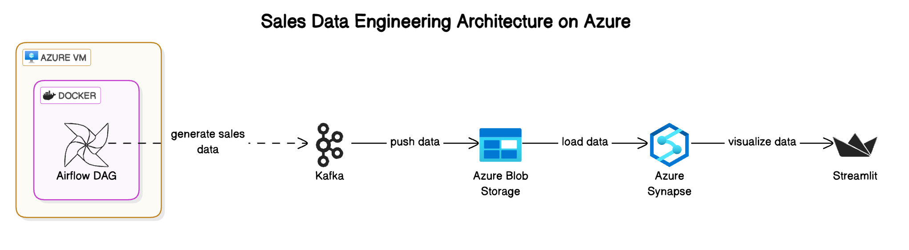

# Real-Time Retail Sales Analytics Platform 🛍️📊

A comprehensive data pipeline and analytics solution for processing retail sales data using Apache Airflow, Azure Synapse Analytics, Apache Kafka, and Streamlit.

[](https://retail-sales-dashboard.streamlit.app/)

## Table of Contents 📑
- [Architecture Overview](#architecture-overview)
- [Project Components](#project-components)
- [Setup Instructions](#setup-instructions)
- [Data Pipeline Details](#data-pipeline-details)
- [Dashboard Features](#dashboard-features)
- [Installation & Configuration](#installation--configuration)
- [Usage](#usage)
- [Contributing](#contributing)

## Architecture Overview 🏗️



The architecture follows a modern data engineering pattern with the following components:
- **Data Generation & Orchestration**: Apache Airflow on Azure VM
- **Message Streaming**: Apache Kafka
- **Data Storage**: Azure Blob Storage
- **Data Warehouse**: Azure Synapse Analytics
- **Visualization**: Streamlit Dashboard

## Project Components 🔧

1. **Airflow Data Pipeline** (`sales_data_pipeline.py`):
   - Generates synthetic retail sales data
   - Streams data to Kafka topics
   - Loads data into Azure Blob Storage
   - Syncs data with Azure Synapse Analytics
   - Handles data cleanup and maintenance

2. **Streamlit Dashboard** (`sales_app.py`):
   - Interactive sales analytics dashboard
   - Real-time data visualization
   - Multiple analysis views and metrics
   - Responsive design for various devices

3. **Infrastructure Setup**:
   - [Airflow Azure Setup Guide](https://gist.github.com/ifyjakande/35470851ebef0cbee925090567e57cfc)
   - [Synapse Analytics Configuration Guide](https://gist.github.com/ifyjakande/c6fa92f7cd2ba7e137a3d3443631d4b7)

## Dashboard Features 📈

Access the live dashboard: [Retail Sales Dashboard](https://retail-sales-dashboard.streamlit.app/)

### Interactive Features 🔄
- **Auto-Refresh Capability**: Configurable refresh intervals (5-300 seconds)
- **Manual Refresh Option**: Instant data refresh button
- **Last Update Indicator**: Shows timestamp of most recent data refresh
- **Dynamic Configuration**: Adjustable number of scorecards and charts

### Visualization Components 📊
1. **Scorecards**
   - Configurable metrics (up to 10 cards)
   - Supports Total, Average, and Count aggregations
   - Real-time metric updates
   - Color-coded for better visibility

2. **Charts**
   - Multiple chart types:
     - Bar Charts: For categorical comparisons
     - Line Charts: For time-series analysis
     - Doughnut Charts: For composition analysis
   - Up to 10 concurrent charts
   - Customizable axes and metrics
   - Interactive tooltips and legends

3. **Data Preview**
   - Real-time data table view
   - Sample data display
   - Column information

4. **Chart Recommendations**
   - Smart column type detection
   - Automatic suggestions for:
     - Time-based visualizations
     - Categorical comparisons
     - Numeric aggregations

### Styling and UI 🎨
- **Modern Design Elements**:
  - Gradient text effects
  - Responsive card layouts
  - Clean, minimalist interface
  - Dark/Light mode support

- **Professional Typography**:
  - Custom fonts (Helvetica Neue)
  - Hierarchical text sizing
  - Consistent spacing

- **Interactive Elements**:
  - Hover effects
  - Smooth transitions
  - Responsive controls

### Technical Features ⚙️
1. **Data Processing**:
   - Real-time aggregation
   - Dynamic filtering
   - Automatic data type detection
   - Error handling and validation

2. **Performance Optimizations**:
   - Efficient data loading
   - Caching mechanisms
   - Optimized refresh cycles
   - Resource-aware rendering

3. **Integration Features**:
   - Azure Synapse Analytics connection
   - SQL query optimization
   - Secure credential management
   - Error recovery mechanisms

## Installation & Configuration ⚙️

### 1. Repository Setup
```bash
git clone https://github.com/ifyjakande/sales-dashboard-streamlit.git
cd sales-dashboard-streamlit
```

### 2. Environment Setup
```bash
python -m venv venv
source venv/bin/activate  # or `venv\Scripts\activate` on Windows
pip install -r requirements.txt
```

Required packages:
- streamlit
- pandas
- numpy
- plotly
- sqlalchemy
- python-dotenv
- azure-storage-blob

### 3. Airflow Services
```bash
docker-compose up -d
```

### 4. Streamlit Configuration
Configure your secrets in the Streamlit Cloud dashboard:
1. Go to your app's dashboard on Streamlit Cloud
2. Navigate to the "Secrets" section
3. Add the following secrets:
```toml
server = "your-synapse-workspace.sql.azuresynapse.net"
database = "your-database"
username = "your-username"
password = "your-password"
```
These secrets will be securely stored and accessible to your application.

## Usage 💡

### 1. Data Pipeline Setup
Access Airflow UI:
```
http://your-vm-ip:8081
```
- Default credentials: airflow/airflow
- Enable the sales_data_generator DAG
- Monitor task execution and logs

### 2. Pipeline Monitoring
- Check task status in Airflow UI
- Verify data in Azure Blob Storage
- Confirm Synapse Analytics loading

### 3. Dashboard Configuration
1. **Initial Setup**:
   ```python
   streamlit run sales_app.py
   ```
   Or visit: [Retail Sales Dashboard](https://retail-sales-dashboard.streamlit.app/)

2. **Scorecard Configuration**:
   - Select number of scorecards (0-10)
   - Choose metrics for each card:
     - Available metrics: Sales, Profit, Quantity, etc.
     - Aggregation functions: Total, Average, Count
   - Configure update frequency

3. **Chart Setup**:
   - Select number of charts (1-10)
   - For each chart, configure:
     - X-axis column
     - Y-axis column
     - Aggregation method
     - Chart type (Bar/Line/Doughnut)
   - Adjust layout and positioning

4. **Refresh Settings**:
   - Configure auto-refresh interval (5-300 seconds)
   - Enable/disable auto-refresh
   - Use manual refresh as needed

5. **Data Preview**:
   - Review raw data samples
   - Check column data types
   - Review chart recommendations

## Contributing 🤝

1. Fork the repository
2. Create your feature branch:
   ```bash
   git checkout -b feature/AmazingFeature
   ```
3. Commit your changes:
   ```bash
   git commit -m 'Add some AmazingFeature'
   ```
4. Push to the branch:
   ```bash
   git push origin feature/AmazingFeature
   ```
5. Open a Pull Request

---
Built with ❤️ using Apache Airflow, Azure Cloud, and Streamlit
